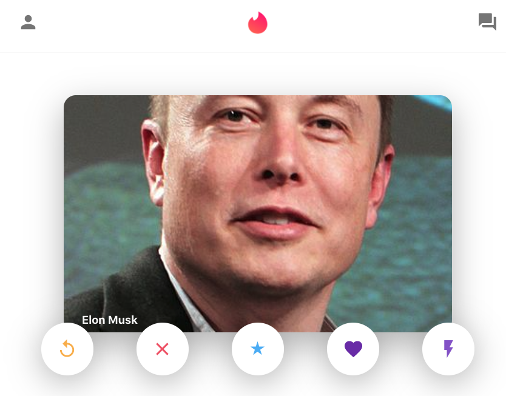

# tinder-clone

This is a MERN project. Successfully created the main page of the tinder app. Users can swipe left or right. Only have two users in the database. 

The data is stored on MongoDB atlas. 

Used Material-UI for icons and buttons.

Used dependency CORS, which is middleware, to make a request to an API with a different domain. 

Used axios to help make http request to external resources.

